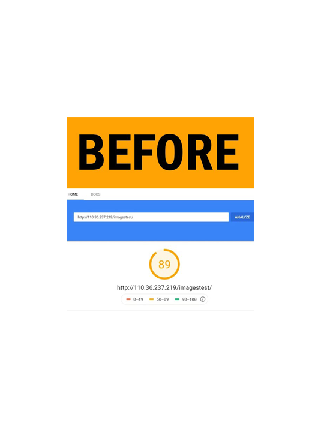
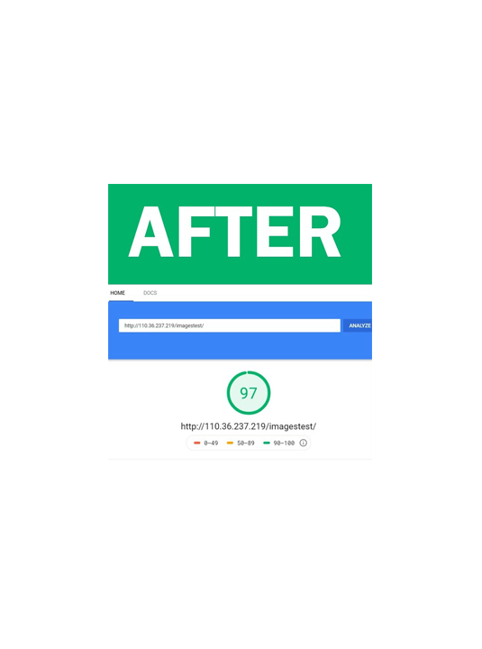

# Defer Offscreen Images | How to improve website speed ?


## First create simple Gallery images wesite in HTML and check Google speed testing 

https://developers.google.com/speed/pagespeed/insights/


<b> 1) Download the lazysizes Javascript library . Once download ,include it in your page through following script tag :</b>
```
     <script src="lazysizes.min.js" async=""></script>
```
<b> 2) within your HTML ``` tag:``` </b>

* Add class="lazyload" attribute to all images
* Change the src attribute to data-src
 
    <!--Use data-src. And,specify lazyload class-->
```
    
```


<b>Before Defer Offscreen Images website speed</b>



<h2>For more useful articles or blogs visit our website:</h2>

https://www.mobitsolutions.com/blog

<h2>About Us:</h2>
php web development company | website design and development

https://www.mobitsolutions.com/website-design-development

<h2>Video Tutorial:</h2>
https://youtu.be/Z6G1J4MnMeQ
